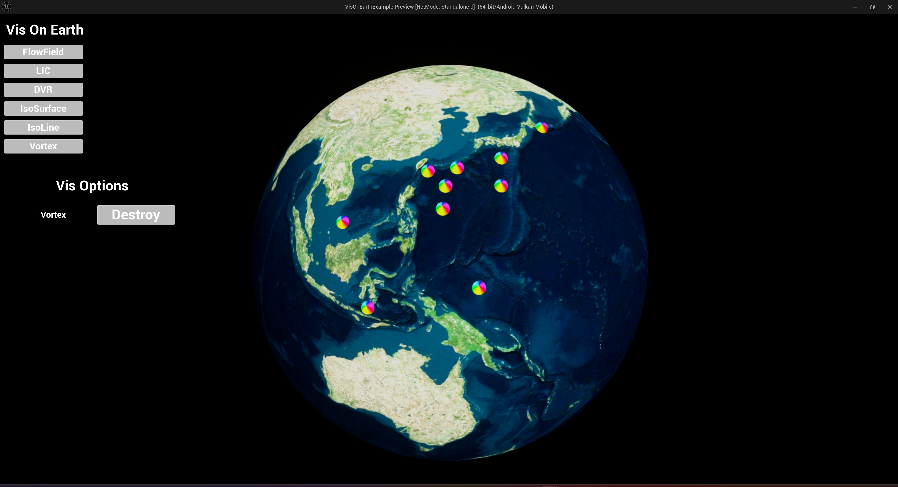

# Visualization On Earth
## Env
* UE 5.3.2

## Vis
- [x] FlowField 2D
- [ ] FlowField 3D (Buggy)
- [x] LIC
- [x] Vortex Detection
- [ ] Radar (WIP)
* Below are Kouek's Work:
- [x] DVR
- [ ] Iso Surface (Marching Cube)
- [x] Iso Line (Marching Cube Square)
- [ ] Heat Map 2D & 3D

## Gallery

